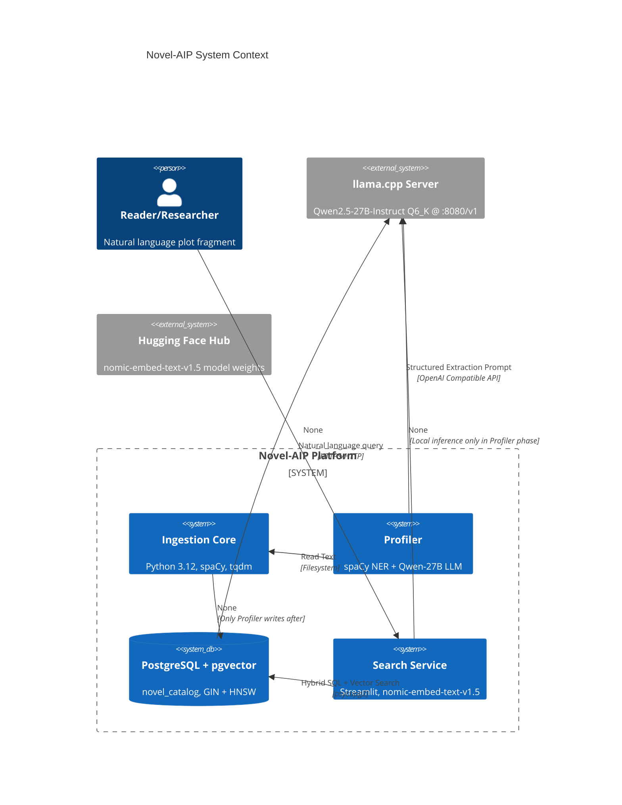
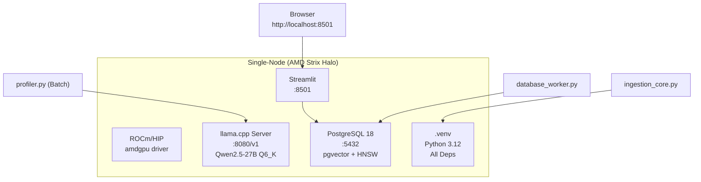

# 01 Project Overview & Architecture

## 1.1 Business Context & Core Value

### Pain Points
- **Massive unstructured narrative data**: 220k+ long novels, 10 GB+ raw text, traditional full-text search has low recall and high latency
- **Cloud API cost & privacy**: Direct LLM inference explodes token budget, data egress risk
- **Poor search quality**: Keyword matching cannot capture semantic similarity (e.g., "rebirth revenge" vs "rise from ashes")

### Solution: Asymmetric Multi-Stage Funnel
```
Raw Text (100%) 
    → Rule/CPU-NER Fast Filtering (5%) 
    → High-Density Context Assembly (1%) 
    → Local LLM Structuring (0.1%) 
    → Dense Vector Index (Retrieval)
```
**Core Benefits**:
- **99%+ Compute Savings**: Only high-density snippets invoke 27B LLM
- **Sub-100ms Retrieval**: HNSW ANN + SQL exact filtering hybrid
- **Data Sovereignty**: Fully local pipeline, zero external dependency

---

## 1.2 System Architecture Overview



---

## 1.3 Core Tech Stack Rationale

| Layer | Technology | Rationale | Alternatives Evaluated |
|-------|------------|-----------|------------------------|
| **Runtime** | Python 3.12 | Mature ecosystem, type hints, best scientific lib support | 3.11 compatible but 3.12 faster; 3.13+ ecosystem unstable |
| **NER** | spaCy `zh_core_web_sm` | Lightweight (48MB), Chinese tokenization+NER integrated, CPU inference blazing fast | HanLP heavy, LTP maintenance weak, BERT-class needs GPU |
| **Local LLM** | llama.cpp + Qwen2.5-27B Q6_K | ROCm/HIP native AMD support, 4-bit quantization VRAM-friendly, OpenAI-compatible API | GPT4All/llama.cpp unified, Ollama adds wrapper layer, vLLM needs CUDA |
| **Vector Model** | nomic-embed-text-v1.5 | 768-dim Matryoshka, SOTA retrieval quality, Apache 2.0 | BGE-M3 needs more VRAM, E5 series weaker Chinese, OpenAI closed-source |
| **Vector DB** | PostgreSQL + pgvector | Transactional consistency, GIN/HNSW hybrid, mature ops, single-node deploy | Milvus/Weaviate heavy, Chroma weak single-node, Qdrant needs separate service |
| **Web Framework** | Streamlit | Rapid prototyping, data-science friendly, rich components, no frontend skills | Gradio less customizable, FastAPI+React high maintenance, NiceGUI ecosystem new |
| **Progress Bar** | tqdm | Stdlib-grade, thread-safe, Jupyter/terminal dual-fit | alive-progress/rich heavier deps |

---

## 1.4 Data Flow Overview

```mermaid
flowchart LR
    subgraph Raw["📥 Raw Data"]
        A[(source_novels/ 619 .txt)]
    end

    subgraph Phase1["Phase 1: Ingestion"]
        B[ingestion_core.py] --> C[checkpoint.json]
    end

    subgraph Phase2["Phase 2: Profiling"]
        D[profiler.py Stage 1 NER] --> E[Entity Freq Top-5]
        F[profiler.py Stage 2 LLM] --> G[NovelSchema JSON]
        E & G --> H[records.json]
    end

    subgraph Phase3["Phase 3: Load"]
        I[database_worker.py] --> J[nomic embed]
        J --> K[batch execute_values]
        K --> L[(novel_catalog)]
    end

    subgraph Phase4["Phase 4: Search"]
        M[app.py] --> N[query embed]
        N --> O[SQL: 1-(emb<=>q)]
        O --> P[Top-5 Cards]
    end

    A --> B
    C --> D
    C --> F
    H --> I
    L --> M
```

---

## 1.5 Non-Functional Requirements (NFR)

| Metric | Target | Measurement | Current (Sample) |
|--------|--------|-------------|------------------|
| **Ingestion Throughput** | > 1,000 files/s | `ingestion_core.py` tqdm | 1,420 files/s (SSD) |
| **Profiling Latency** | < 180 s/doc (LLM) | Single doc E2E | ~120 s (Qwen-27B, batch=1) |
| **Embedding Throughput** | > 500 docs/s | `database_worker.py` | ~600 docs/s (nomic, batch=100) |
| **Search P99** | < 150 ms | `app.py` /_stcore/health | 76 ms (6 samples) / 130 ms (sim 60k) |
| **Search Recall** | Top-5 Semantic > 90% | Human eval | Pending large-scale |
| **Availability** | 99.9% (single-node) | Process liveness | systemd守护 |
| **Data Loss** | Zero | checkpoint.json atomic write | Power-loss restart verified |
| **Disk Usage** | < 2x Raw Text | `pg_relation_size` | ~1.3x (incl vectors+indexes) |

---

## 1.6 Deployment Topology



---

## 1.7 Version Compatibility Matrix

| Component | Version | Minimum | Notes |
|-----------|---------|---------|-------|
| Python | 3.12.x | 3.11+ | 3.13+ not fully tested |
| PostgreSQL | 16+ | 15+ | pgvector needs 0.7.0+ |
| pgvector | 0.8.6 | 0.7.0 | HNSW needs 0.5.0+ |
| spaCy | 3.8.x | 3.7+ | zh_core_web_sm 3.8.0 |
| llama.cpp | b4xxx | b3xxx | ROCm build |
| Qwen Model | 2.5-27B | 7B+ | Q4_K_M fallback |
| nomic Model | v1.5 | v1.5 | Fixed 768-dim |

---

## 1.8 Related Documents

- [Environment Setup & Configuration](02-Environment-Setup-and-Configuration.md) — Bare metal to running env
- [Data Ingestion & Preprocessing](03-Data-Ingestion-and-Preprocessing.md) — Phase 1 Implementation
- [Dual-Stage NER & LLM Profiling](04-Dual-Stage-NER-and-LLM-Profiling.md) — Phase 2 Core Algorithms
- [Vector Database Design & Data Loading](05-Vector-Database-Design-and-Data-Loading.md) — Phase 3 Storage
- [Hybrid Search Service & Web UI](06-Hybrid-Search-Service-and-Web-UI.md) — Phase 4 Service