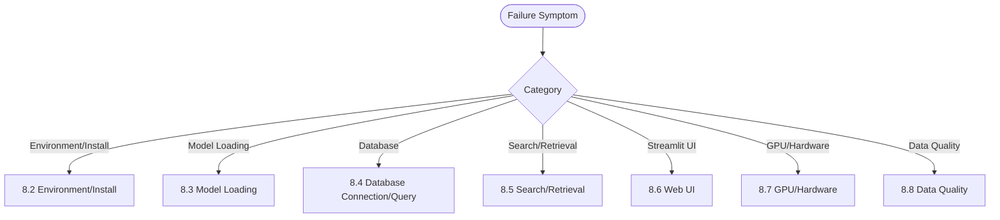

# 08 Troubleshooting & FAQ

## 8.1 Quick Diagnostic Decision Tree



---

## 8.2 Environment & Install Issues

| Symptom | Root Cause | Diagnosis Steps | Solution | Prevention |
|---------|------------|-----------------|----------|------------|
| `setup_env.ps1` "Python 3.11+ required" | PATH Python < 3.11 | `python --version`<br>`where python` | Explicit `-PythonExe "C:\...\Python312\python.exe"` | CI/CD Enforce Explicit Interpreter |
| `spacy download zh_core_web_sm` Hang/Timeout | Network HF Blocked/No Proxy | `curl -I https://huggingface.co` | Set `HF_ENDPOINT=https://hf-mirror.com`<br>Or Pre-download `.whl` Offline `pip install` | Internal Mirror/Private PyPI |
| `pgvector` Compile Fail `Cannot open include file: 'postgres.h'` | `PGROOT` Wrong/Dev Package Missing | `echo $PGROOT`<br>`ls $PGROOT/include/server/postgres.h` | Fix `PGROOT` to Actual PG Install Dir<br>Windows: `C:\Program Files\PostgreSQL\18` | Compile Script Parametrized Path |
| `llama-server.exe` `GGML_ROCM` Error | Driver Mismatch/GPU Unsupported | `rocminfo \| grep gfx`<br>`rocm-smi` | Update AMD Adrenalin to 24.10.1+<br>Verify GPU Supports gfx1151 (RDNA 3.5) | Driver Version Locked in CI/CD |
| `sentence-transformers` nomic 401/403 | Model Requires Accept Terms/Token | `curl -I -H "Authorization: Bearer $HF_TOKEN" https://huggingface.co/nomic-ai/nomic-embed-text-v1.5` | `huggingface-cli login`<br>Or Set `HF_TOKEN` Env Var | CI/CD Inject Secret Token |

---

## 8.3 Model Loading Issues

| Symptom | Root Cause | Diagnosis | Solution | Prevention |
|---------|------------|-----------|----------|------------|
| `SentenceTransformer` Init `OSError: [Errno 22] Invalid Argument` | tqdm Progress Bar Writes to Streamlit Redirected stderr | Stack Points to `tqdm.std.status_printer` → `sys.stderr.flush()` | **Module Top** Set `os.environ.setdefault("TQDM_DISABLE", "1")`<br>**Must Be Before Importing transformers/sentence_transformers** | Code Review Check Import Order |
| `load_embedder()` First Query Hangs > 60s | First-Time Model Weight Download (~1.2 GB) / Slow Disk | `du -sh ~/.cache/huggingface/hub/models--nomic-ai--nomic-embed-text-v1.5` | Warmup Script at Startup<br>`python -c "from app import load_embedder; load_embedder()"` | Deploy Script Includes Warmup |
| `llama-server` Inference Timeout / No Response | Context Too Large / VRAM OOM / Queue Blocked | `rocm-smi --showmemuse vram`<br>`curl -v http://127.0.0.1:8080/v1/chat/completions` | Reduce `-c` Context<br>Increase `-b` Batch<br>Restart to Free VRAM Fragmentation | Monitor VRAM < 90% |
| `ChatOpenAI` Throws `APIConnectionError` / `Timeout` | llama.cpp Not Running / Port Conflict / Proxy Interference | `netstat -an \| grep 8080`<br>`curl http://127.0.0.1:8080/v1/models` | Ensure Service Running<br>Check `NO_PROXY=127.0.0.1,localhost` | systemd Manages llama.cpp |
| `spacy.load("zh_core_web_sm")` `IOError: [E050] Can't find model` | Model Not Downloaded / Wrong Path | `python -m spacy validate` | `python -m spacy download zh_core_web_sm` | `setup_env.ps1` Auto-Downloads |

---

## 8.4 Database Connection/Query Issues

| Symptom | Root Cause | Diagnosis | Solution | Prevention |
|---------|------------|-----------|----------|------------|
| `psycopg2.OperationalError: could not connect to server` | PG Service Down / Firewall / `pg_hba.conf` | `systemctl status postgresql`<br>`pg_isready -h localhost -p 5432` | Start Service<br>Adjust `pg_hba.conf` Local Trust<br>Firewall Allow 5432 | systemd + Health Check |
| `OperationalError: connection already closed` / `SSL SYSCALL error: EOF` | Idle Conn Killed by Firewall/Proxy/DB | Logs Show `SSL SYSCALL error: EOF` / `connection already closed` | Pool Config `keepalives_idle=30`<br>App Heartbeat `SELECT 1` | Pool `keepalives_*` Parametrized |
| `DataError: array value must start with "{" or dimension mismatch` | Vector String Format Wrong / Dim Mismatch | Check `format_vector` Output<br>`SELECT summary_embedding FROM novel_catalog LIMIT 1;` | Ensure `"[0.1,0.2,...]"` Format<br>Dim Strict 768 | Unit Test `format_vector` |
| `ERROR: operator does not exist: vector <=> double precision[]` | Vector String Not Explicitly Cast | SQL Has `embedding <=> %s` But Param Is Python List | Explicit Cast `%s::vector` Or `format_vector` String | Code Review SQL Template |
| `HNSW index build failed: out of memory` | `maintenance_work_mem` Too Small / Data > RAM | `SHOW maintenance_work_mem;`<br>`free -h` | Increase `maintenance_work_mem = '2GB'`<br>Batched Index Build / Add RAM | Capacity Planning Estimates Index Mem |

---

## 8.5 Search/Retrieval Issues

| Symptom | Root Cause | Diagnosis | Solution | Prevention |
|---------|------------|-----------|----------|------------|
| Search Returns Empty / All Scores 0 | Query Vector Missing Prefix / Model Not Loaded / Table No Vectors | `EXPLAIN ANALYZE SELECT ...`<br>`SELECT COUNT(*) FROM novel_catalog WHERE summary_embedding IS NOT NULL;` | Ensure `search_query:` Prefix<br>Ensure `search_document:` Ingestion Prefix<br>Ensure `database_worker.py` Batch Success | Unit Test `embed_query`/`embed_summaries` Prefix Consistency |
| Similarity Score Abnormal (>1 or <0) | Vector Contains NaN/Inf / Not Normalized / Dim Wrong | `SELECT summary_embedding FROM novel_catalog LIMIT 1;`<br>Python `any(math.isnan(v) for v in vec)` | `format_vector` NaN/Inf → 0.0<br>Model Inference Exception Catch Retry | `format_vector` Guard + Model Inference Try-Catch |
| Search Latency Spike (P99 > 500ms) | HNSW `ef_search` Too Large / Pool Exhausted / Index Bloat / Stale Stats | `EXPLAIN ANALYZE ...`<br>`SHOW hnsw.ef_search`<br>`pg_stat_activity` Conn Count | Reduce `ef_search`<br>Expand Pool<br>`REINDEX INDEX CONCURRENTLY`<br>`ANALYZE` | Monitoring Alerts + Periodic REINDEX/ANALYZE |
| Top-K Irrelevant / Semantic Drift | Embedding Model Version Mismatch / Prefix Mismatch / Dirty Data | Compare Ingestion/Query Model Versions<br>Check Prefix Consistency | Pin Model Version `nomic-embed-text-v1.5`<br>Constants Define Prefixes | Constant Prefixes + Version Pinning |

---

## 8.6 Web UI (Streamlit) Issues

| Symptom | Root Cause | Diagnosis | Solution | Prevention |
|---------|------------|-----------|----------|------------|
| Blank Page / "Please wait..." Spins Forever | Model Load Blocks Main Thread / JS Error | Browser DevTools Console<br>Backend Log `Loading weights...` | `st.cache_resource` Cache Model<br>Startup Pre-warm | Startup Script Pre-warm |
| `st.cache_resource` `UnserializableReturnValueError` | Returned Object Not Serializable (DB Conn/Thread Lock) | Stack Points to `cache_utils.py` | Only Cache Serializable (Model/Config)<br>Pool in External Singleton | Code Review Cache Returns |
| Page `OSError: [Errno 22] Invalid Argument` (Recurring) | tqdm Progress Bar Writes Redirected stderr | See 8.3 #1 | See 8.3 #1 | See 8.3 #1 |
| Sidebar Shows "Database unavailable" | DB Connect Fail / Query Timeout | Sidebar Error Detail<br>Backend Log | See 8.4 DB Connection | Sidebar Graceful "N/A" Not Error |
| Result Card Garbled / Missing Fields | `row` Tuple Unpack Order Wrong / Field NULL | Print `row` Raw | Add Defaults `or "—"`<br>SQL Explicit Columns Not `SELECT *` | Type Hints + Render Function Unit Tests |

---

## 8.7 GPU/Hardware Issues

| Symptom | Root Cause | Diagnosis | Solution | Prevention |
|---------|------------|-----------|----------|------------|
| `rocm-smi` Shows 0% GPU Util | llama.cpp Not Offloading Layers / Missing `-ngl` | `rocm-smi -a`<br>`./llama-server --help \| grep ngl` | Add `-ngl 99` Full Offload<br>Verify Model Quant Compatible ROCm | Launch Script Parametrized |
| VRAM OOM / `HIP Error: out of memory` | Model Quant Too Large / Context Too Large / Concurrency High | `rocm-smi --showmemuse vram`<br>`dmesg \| grep -i oom` | Switch Smaller Quant (Q4_K_M)<br>Reduce `-c` Context<br>Limit Concurrency / Queue | VRAM Monitor Alert < 90% |
| System Frequent Swap / Stalls | Physical RAM Insufficient / `mlock` Failed | `free -h`<br>`swapon -s` | Add Physical RAM<br>Enable `--mlock`<br>Disable Swap `swapoff -a` | Prod Minimum 64 GB Unified Memory |
| CPU Thermal Throttle / Clock Drop | Insufficient Cooling / Sustained Full Load | `sensors`<br>`cat /proc/cpuinfo \| grep MHz` | Clean Dust/Replace Thermal Paste<br>Limit Concurrency/Batch | Case Airflow / Server-Grade Cooling |

---

## 8.8 Data Quality Issues

| Symptom | Root Cause | Diagnosis | Solution | Prevention |
|---------|------------|-----------|----------|------------|
| `checkpoint.json` Corrupt / JSON Parse Fail | Process Crash Mid-Write / Disk Full / Manual Edit Error | `jq . checkpoint.json`<br>`python -m json.tool checkpoint.json` | Delete Corrupt → Re-scan<br>Or Manual JSON Fix | Atomic Write `os.replace(tmp, target)` |
| `ingestion_core.py` Marks FAILED But File Readable | Encoding Detect Order / File Lock Race | Compare `chardet.detect()` Results | Adjust Encoding Priority<br>Add Retry Delay | Encoding Detect Unit Tests Cover Common |
| `profiler.py` Empty Genres/Tropes | LLM Empty JSON / Fallback Triggered / Prompt Parse Fail | Backend Log `LLM profiling failed` | Check llama.cpp Log<br>Verify Prompt Escaping Correct<br>Add Retry Count | Prompt Unit Test + Fallback Unit Test |
| `database_worker.py` Vector Dim Error After Load | Model Version Changed / Manual `EMBEDDING_DIM` Edit | `SELECT vector_dims(summary_embedding) FROM novel_catalog LIMIT 1;` | Align `EMBEDDING_DIM` With Model Output<br>Re-run `database_worker.py` | Constant Dim + Startup Validation |

---

## 8.9 Universal Debug Toolbox

| Tool | Purpose | Common Commands |
|------|---------|-----------------|
| `psql` | Interactive SQL Debug | `\d novel_catalog` `\x on` `EXPLAIN ANALYZE ...` |
| `journalctl` | Service Log Aggregation | `-u novel-aip -u postgresql -u llama-cpp -f -p err` |
| `htop` / `btop` | Real-Time Resource Monitor | `F2` Configure Columns GPU/Mem/Net |
| `rocm-smi` / `nvidia-smi` | GPU VRAM/Util/Temp | `-a` Full `-m` VRAM `--showtemp` |
| `strace` / `ltrace` | Syscall/Library Call Trace | `-f -e trace=network,file -p <pid>` |
| `curl -v` | HTTP Interface Debug | `-H "Authorization: Bearer $TOKEN"` |
| `python -m py_compile` | Syntax Quick Check | `file.py` |
| `pylint` / `ruff` | Static Analysis | `--select=E,F --ignore=E501` |
| `pytest -xvs` | Unit/Integration Test | `-k "test_search" --tb=short` |

---

## 8.10 Postmortem Template

```markdown
# Postmortem: [Title]

## 1. Incident Summary
- Time Window:
- Impact Scope:
- User-Facing Symptoms:

## 2. Timeline
| Time | Event | Operator |
|------|-------|----------|
| 2026-09-14 10:00 | Alert: Search P99 > 500ms | Monitoring |
| 2026-09-14 10:05 | SSH to Server | Alice |

## 3. Root Cause (5 Whys)
1. Why High Latency? → HNSW ef_search=400
2. Why ef_search=400? → Manual Tune Not Reverted
3. Why Manual Tune? → Last Week Recall Test Not Reverted
4. Why Not Reverted? → No Change Approval Process
5. Why No Process? → Ops Standards Missing

## 3. Impact Assessment
- Affected Users:
- Business Loss:
- Data Consistency:

## 4. Remediation
- Immediate: `SET hnsw.ef_search = 100;`
- Short-term: Code Hardcodes `ef_search=100` Prevent Runtime Change
- Long-term: Change Management + Read Replica Isolation for Experiments

## 5. Prevention
- [ ] All Runtime Params Under Config Management
- [ ] Changes Require PR + Review + Canary
- [ ] Add `ef_search` Monitor Alert

## 6. Lessons Learned
- Runtime Param Changes Must Leave Audit Trail
- Core Params Should Be Config Not Hardcoded
```

---

## 8.11 Related Documents

- [Environment Setup & Configuration](02-Environment-Setup-and-Configuration.md) — Install-Time Failures
- [Operations, Monitoring & Performance Tuning](07-Operations-Monitoring-and-Performance-Tuning.md) — Metric Definitions
- [API Reference & Specifications](09-API-Reference-and-Specifications.md) — Error Code Mapping
- [Extension Development Guide](10-Extension-Development-Guide.md) — Custom Exception/Retry Extensions