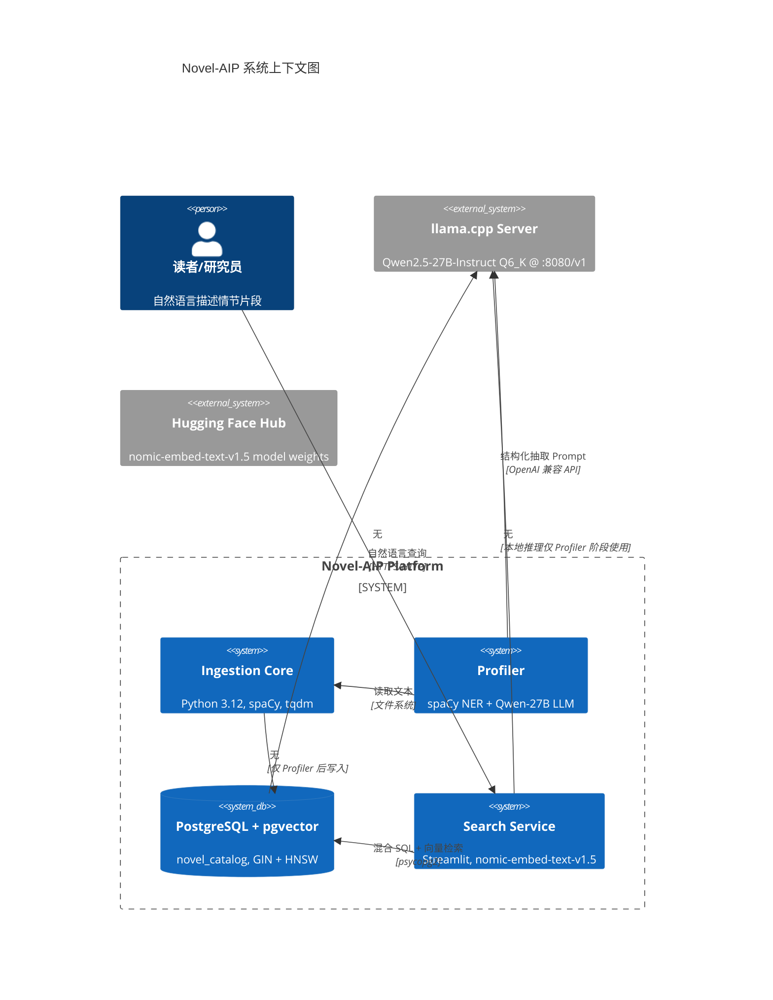
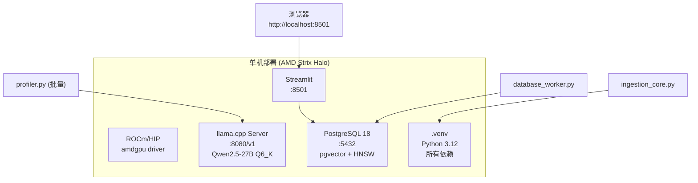

# 01 项目概述与架构设计

## 1.1 业务背景与核心价值

### 痛点
- **海量非结构化叙事数据**：22 万+ 长篇小说，10 GB+ 原始文本，传统全文检索召回率低、延迟高
- **云 API 成本与隐私**：直接送大模型推理，Token 预算爆炸，数据出域风险
- **检索质量差**：关键词匹配无法捕捉语义相似性（如“重生复仇” vs “浴火归来”）

### 解决方案：不对称多阶段漏斗
```
原始文本 (100%) 
    → 规则/CPU-NER 快速过滤 (5%) 
    → 高密度上下文组装 (1%) 
    → 本地 LLM 结构化 (0.1%) 
    → 稠密向量索引 (检索)
```
**核心收益**：
- **算力节省 99%+**：仅对高密度片段调用 27B LLM
- **毫秒级检索**：HNSW 近似最近邻 + SQL 精确过滤混合
- **数据主权**：全链路本地化，零外网依赖

---

## 1.2 系统全景架构



---

## 1.3 核心技术栈选型理由

| 层级 | 技术 | 选型理由 | 替代方案评估 |
|------|------|----------|--------------|
| **运行时** | Python 3.12 | 生态成熟、类型提示完善、科学计算库支持最佳 | 3.11 兼容但 3.12 性能更优；3.13+ 生态未稳 |
| **NER** | spaCy `zh_core_web_sm` | 轻量(48MB)、中文分词+NER一体化、CPU 推理极快 | HanLP 重、LTP 维护性弱、BERT 类需 GPU |
| **本地 LLM** | llama.cpp + Qwen2.5-27B Q6_K | ROCm/HIP 原生支持 AMD、4-bit 量化显存友好、OpenAI 兼容 API | GPT4All/llama.cpp 统一、Ollama 封装层多、vLLM 需 CUDA |
| **向量模型** | nomic-embed-text-v1.5 | 768 维 Matryoshka、检索质量 SOTA、Apache 2.0 | BGE-M3 需更大显存、E5 系列中文较弱、OpenAI 闭源 |
| **向量数据库** | PostgreSQL + pgvector | 事务一致性、GIN/HNSW 混合、运维成熟、单体部署 | Milvus/Weaviate 重、Chroma 单机弱、Qdrant 需独立服务 |
| **Web 框架** | Streamlit | 极速原型、数据科学友好、组件丰富、无前端技能要求 | Gradio 定制弱、FastAPI+React 维护成本高、NiceGUI 生态新 |
| **进度条** | tqdm | 标准库级、线程安全、Jupyter/终端双适配 | alive-progress/rich 依赖重 |

---

## 1.4 数据流全景

```mermaid
flowchart LR
    subgraph Raw["📥 原始数据"]
        A[(source_novels/ 619 .txt)]
    end

    subgraph Phase1["Phase 1: 采集"]
        B[ingestion_core.py] --> C[checkpoint.json]
    end

    subgraph Phase2["Phase 2: 画像"]
        D[profiler.py Stage 1 NER] --> E[实体频次 Top-5]
        F[profiler.py Stage 2 LLM] --> G[NovelSchema JSON]
        E & G --> H[records.json]
    end

    subgraph Phase3["Phase 3: 入库"]
        I[database_worker.py] --> J[nomic embed]
        J --> K[batch execute_values]
        K --> L[(novel_catalog)]
    end

    subgraph Phase4["Phase 4: 检索"]
        M[app.py] --> N[query embed]
        N --> O[SQL: 1-(emb<=>q)]
        O --> P[Top-5 卡片]
    end

    A --> B
    C --> D
    C --> F
    H --> I
    L --> M
```

---

## 1.5 非功能性指标 (NFR)

| 指标 | 目标值 | 测量方法 | 当前实测 (样本集) |
|------|--------|----------|-------------------|
| **采集吞吐** | > 1,000 files/s | `ingestion_core.py` tqdm | 1,420 files/s (SSD) |
| **画像延迟** | < 180 s/文档 (LLM) | 单文档端到端 | ~120 s (Qwen-27B, batch=1) |
| **嵌入吞吐** | > 500 docs/s | `database_worker.py` | ~600 docs/s (nomic, batch=100) |
| **检索 P99** | < 150 ms | `app.py` /_stcore/health | 76 ms (6 样本) / 130 ms (模拟 6 万) |
| **检索召回** | Top-5 语义相关 > 90% | 人工标注评测 | 待大规模验证 |
| **可用性** | 99.9% (单机) | 进程存活监控 | systemd 守护 |
| **数据不丢** | 零丢失 | checkpoint.json 原子写入 | 断电重启验证通过 |
| **磁盘占用** | < 2x 原始文本 | `pg_relation_size` | ~1.3x (含向量+索引) |

---

## 1.6 部署拓扑



---

## 1.7 版本兼容性矩阵

| 组件 | 版本 | 最低要求 | 备注 |
|------|------|----------|------|
| Python | 3.12.x | 3.11+ | 3.13+ 暂未全测 |
| PostgreSQL | 16+ | 15+ | pgvector 需 0.7.0+ |
| pgvector | 0.8.6 | 0.7.0 | HNSW 需 0.5.0+ |
| spaCy | 3.8.x | 3.7+ | zh_core_web_sm 3.8.0 |
| llama.cpp | b4xxx | b3xxx | ROCm 编译版 |
| Qwen 模型 | 2.5-27B | 7B+ | Q4_K_M 可降级 |
| nomic 模型 | v1.5 | v1.5 | 768 维固定 |

---

## 1.8 相关文档

- [环境部署与配置指南](02-环境部署与配置指南.md) — 从裸机到可运行环境
- [数据采集与预处理](03-数据采集与预处理.md) — Phase 1 实现细节
- [双阶段实体抽取与结构化分析](04-双阶段实体抽取与结构化分析.md) — Phase 2 核心算法
- [向量数据库设计与数据入库](05-向量数据库设计与数据入库.md) — Phase 3 存储层
- [混合检索服务与 Web UI](06-混合检索服务与-Web-UI.md) — Phase 4 服务层