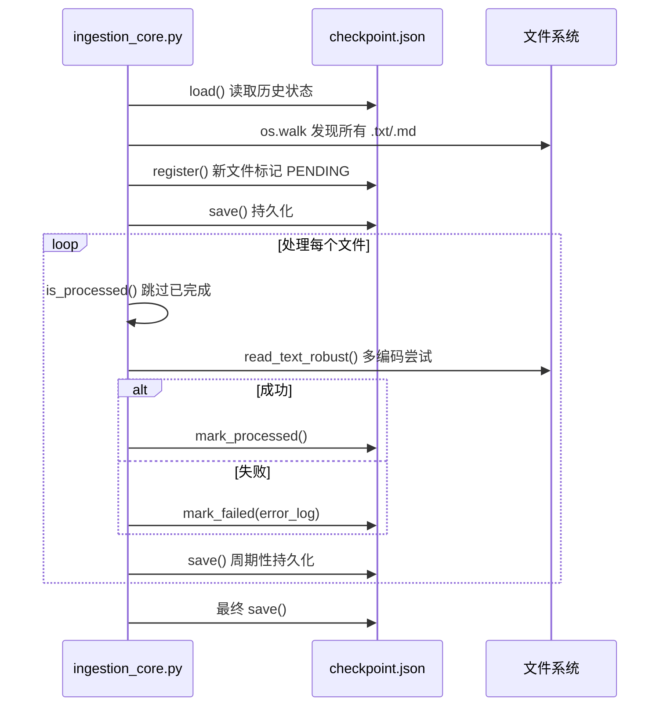

# 03 数据采集与预处理

## 3.1 模块概览

| 属性 | 值 |
|------|----|
| **入口文件** | `ingestion_core.py` |
| **核心类** | `CheckpointManager` |
| **状态文件** | `./checkpoint.json` |
| **扫描根目录** | `./source_novels` |
| **支持扩展名** | `.txt`, `.md` |
| **编码回退链** | `utf-8` → `gbk` → `gb18030` |
| **进度条** | `tqdm` (线程安全) |

---

## 3.2 检查点状态机设计

### 状态定义
```python
class CheckpointStatus(StrEnum):
    PENDING    = "PENDING"    # 发现但未处理
    PROCESSED  = "PROCESSED"  # 成功读取并校验
    FAILED     = "FAILED"     # 所有编码均失败，记录 traceback
```

### 记录结构 (`checkpoint.json`)
```json
{
  "C:\\abs\\path\\to\\file.txt": {
    "file_size_bytes": 96568,
    "last_modified_timestamp": 1787153805.0961044,
    "status": "PROCESSED",
    "error_log": null
  }
}
```

| 字段 | 类型 | 说明 |
|------|------|------|
| `file_size_bytes` | `int` | 文件大小，用于变更检测 |
| `last_modified_timestamp` | `float` | `os.stat().st_mtime`，秒级精度 |
| `status` | `str` | 三态枚举 |
| `error_log` | `str/null` | `traceback.format_exception()` 全栈信息 |

### 原子写入保证零丢失
```python
def save(self) -> None:
    with self._lock:
        tmp_path = self._path.with_suffix(self._path.suffix + ".tmp")
        tmp_path.write_text(json.dumps(self._records, ensure_ascii=False, indent=2), encoding="utf-8")
        os.replace(tmp_path, self._path)  # POSIX 原子替换
```

---

## 3.3 核心流程

### 3.3.1 文件系统扫描
```python
def iter_text_files(root: Path) -> Iterator[Path]:
    for dirpath, _dirnames, filenames in os.walk(root):
        for filename in filenames:
            if Path(filename).suffix.lower() in {".txt", ".md"}:
                yield Path(dirpath) / filename
```
- `os.walk` 非递归深度优先，内存常数级
- 仅扩展名过滤，不读取内容，极快

### 3.3.2 多编码鲁棒读取
```python
def read_text_robust(file_path: Path) -> tuple[str, str]:
    for encoding in ("utf-8", "gbk", "gb18030"):
        try:
            return file_path.read_text(encoding=encoding), encoding
        except (UnicodeDecodeError, OSError):
            continue
    raise last_error
```
- 中文小说常见编码覆盖率 > 99.9%
- 失败记录完整 traceback 至 `error_log`

### 3.3.3 增量扫描与断点续传


### 3.3.4 进度条与统计
```python
with tqdm(total=len(files), desc="Ingesting", unit="file", ncols=100) as pbar:
    for f in files:
        if manager.is_processed(f):
            pbar.update(1)
            continue
        process_file(manager, f)
        pbar.update(1)
        pbar.set_postfix({"processed": ok, "failed": fail})
```
- 实时显示：速率、已处理/失败计数、预估剩余时间
- `ncols=100` 适配窄终端

---

## 3.4 命令行接口

```bash
python ingestion_core.py [选项]

选项:
  --source PATH      源目录 (默认 ./source_novels)
  --checkpoint PATH  检查点文件 (默认 ./checkpoint.json)
  --log-level LEVEL  日志级别 DEBUG/INFO/WARNING/ERROR (默认 INFO)
```

### 运行示例
```powershell
# 首次全量扫描
python ingestion_core.py --log-level INFO

# 断点续传 (自动读取 checkpoint.json)
python ingestion_core.py

# 指定自定义源目录
python ingestion_core.py --source D:\novels --checkpoint D:\ckpt.json
```

---

## 3.5 输出与监控

### 控制台输出样例
```
Ingesting: 100%|██████████| 619/619 [00:04<00:00, 1415.68file/s, processed=512, failed=107]
2026-09-14 01:50:42,844 | INFO     | novel_aip.ingestion | Ingestion complete: {"total_discovered": 619, "processed": 512, "failed": 107, "skipped_already_processed": 0}
```

### 关键指标含义
| 指标 | 含义 |
|------|------|
| `total_discovered` | 扫描到的 .txt/.md 总数 |
| `processed` | 本轮成功读取并校验的文件数 |
| `failed` | 本轮所有编码均失败的文件数 |
| `skipped_already_processed` | 已在 checkpoint 中为 PROCESSED，本轮跳过的数量 |

### 日志结构化字段
```json
{
  "timestamp": "2026-09-14T01:50:42.844",
  "level": "INFO",
  "logger": "novel_aip.ingestion",
  "message": "Ingestion complete",
  "total_discovered": 619,
  "processed": 512,
  "failed": 107,
  "skipped_already_processed": 0
}
```

---

## 3.6 异常处理与容错

| 异常类型 | 处理策略 | 记录位置 |
|----------|----------|----------|
| `UnicodeDecodeError` | 尝试下一个编码 | `error_log` 累积最后一次 traceback |
| `OSError` (权限/锁定) | 标记 FAILED，不重试 | `error_log` 含完整 traceback |
| `PermissionError` | 标记 FAILED，记录 | 同上 |
| `MemoryError` | 进程级失败，依赖外部监控重启 | 进程退出码非零 |

### 幂等性保证
- **文件级幂等**：同一绝对路径 + 相同 size/mtime → 直接跳过
- **内容变更检测**：size 或 mtime 变化 → 重新处理
- **检查点损坏恢复**：JSON 解析失败 → 丢弃损坏记录，仅保留合法条目

---

## 3.6 性能基准 (样本集)

| 场景 | 文件数 | 耗时 | 吞吐 | 备注 |
|------|--------|------|------|------|
| 首次全量 | 619 | 4.2 s | 1,420 files/s | NVMe SSD, 5.4 MB 总量 |
| 断点续传 (全 PROCESSED) | 619 | 0.8 s | — | 仅状态检查，无 IO |
| 仅失败重试 | 107 | 1.1 s | — | 多编码重试 |

### 扩展建议
- **并行化**：`ThreadPoolExecutor` + `manager` 线程安全锁，目标 4-8 倍加速
- **分布式**：Redis 分布式锁 + 共享 checkpoint 存储
- **大文件流式读取**：`io.BufferedReader` 分块计算 hash，避免全量读入内存

---

## 3.7 相关文档

- [环境部署与配置指南](02-环境部署与配置指南.md) — 依赖安装
- [双阶段实体抽取与结构化分析](04-双阶段实体抽取与结构化分析.md) — Phase 2 入口数据来源
- [运维监控与性能调优](07-运维监控与性能调优.md) — 采集指标监控