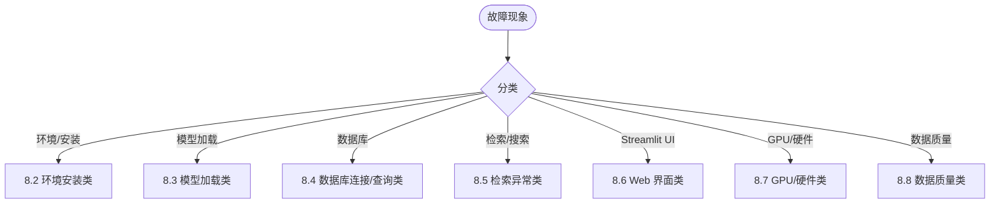

# 08 故障排查与常见问题

## 8.1 快速诊断决策树



---

## 8.2 环境安装类

| 现象 | 根因 | 定位步骤 | 解决方案 | 预防 |
|------|------|----------|----------|------|
| `setup_env.ps1` 报 "Python 3.11+ required" | PATH 中 python 版本 < 3.11 | `python --version`<br>`where python` | 显式指定 `-PythonExe "C:\...\Python312\python.exe"` | CI/CD 强制指定解释器路径 |
| `spacy download zh_core_web_sm` 卡住/超时 | 网络访问 HF 受限/无代理 | `curl -I https://huggingface.co` | 设置 `HF_ENDPOINT=https://hf-mirror.com`<br>或预下载 `.whl` 离线 `pip install` | 内网镜像站/私有 PyPI |
| `pgvector` 编译失败 `Cannot open include file: 'postgres.h'` | `PGROOT` 路径错误/未安装开发包 | `echo $PGROOT`<br>`ls $PGROOT/include/server/postgres.h` | 修正 `PGROOT` 为实际 PG 安装目录<br>Windows: `C:\Program Files\PostgreSQL\18` | 编译脚本参数化路径 |
| `llama-server.exe` 启动报 `GGML_ROCM` 错误 | 驱动版本不匹配/GPU 不支持 ROCm | `rocminfo \| grep gfx`<br>`rocm-smi` | 更新 AMD Adrenalin 至 24.10.1+<br>确认 GPU 支持 gfx1151 (RDNA 3.5) | 驱动版本锁定在 CI/CD |
| `sentence-transformers` 下载 nomic 模型 401/403 | 模型需接受条款/需 Token | `curl -I -H "Authorization: Bearer $HF_TOKEN" https://huggingface.co/nomic-ai/nomic-embed-text-v1.5` | `huggingface-cli login`<br>或设置 `HF_TOKEN` 环境变量 | CI/CD 注入密文 Token |

---

## 8.3 模型加载类

| 现象 | 根因 | 定位步骤 | 解决方案 | 预防 |
|------|------|----------|----------|------|
| `SentenceTransformer` 初始化 `OSError: [Errno 22] Invalid argument` | tqdm 进度条写入 Streamlit 重定向的 stderr | 堆栈指向 `tqdm.std.status_printer` → `sys.stderr.flush()` | **模块顶部**设置 `os.environ.setdefault("TQDM_DISABLE", "1")`<br>**必须在导入 transformers/sentence_transformers 之前** | 代码审查检查导入顺序 |
| `load_embedder()` 首次查询卡住 > 60s | 首次下载模型权重 (~1.2 GB) / 磁盘慢 | `du -sh ~/.cache/huggingface/hub/models--nomic-ai--nomic-embed-text-v1.5` | 预热脚本启动时触发加载<br>`python -c "from app import load_embedder; load_embedder()"` | 部署脚本包含预热步骤 |
| `llama-server` 推理超时 / 无响应 | 上下文窗口过大 / 显存不足 / 队列阻塞 | `rocm-smi --showmemuse vram`<br>`curl -v http://127.0.0.1:8080/v1/chat/completions` | 减小 `-c` 上下文窗口<br>增大 `-b` 批大小<br>重启服务释放显存碎片 | 监控显存使用率 < 90% |
| `ChatOpenAI` 抛 `APIConnectionError` / `Timeout` | llama.cpp 服务未启动 / 端口占用 / 代理干扰 | `netstat -an \| grep 8080`<br>`curl http://127.0.0.1:8080/v1/models` | 确认服务启动<br>检查 `NO_PROXY=127.0.0.1,localhost` | systemd 管理 llama.cpp 服务 |
| `spacy.load("zh_core_web_sm")` 报 `IOError: [E050] Can't find model` | 模型未下载 / 路径错误 | `python -m spacy validate` | `python -m spacy download zh_core_web_sm` | `setup_env.ps1` 自动下载 |

---

## 8.4 数据库连接/查询类

| 现象 | 根因 | 定位步骤 | 解决方案 | 预防 |
|------|------|----------|----------|------|
| `psycopg2.OperationalError: could not connect to server` | PostgreSQL 服务未启动 / 防火墙 / `pg_hba.conf` | `systemctl status postgresql`<br>`pg_isready -h localhost -p 5432` | 启动服务<br>调整 `pg_hba.conf` 允许本地信任<br>防火墙放行 5432 | systemd 管理 + 健康检查 |
| `psycopg2.OperationalError: connection already closed` / `SSL SYSCALL error: EOF detected` | 空闲连接被防火墙/代理/数据库切断 | 日志出现 `SSL SYSCALL error: EOF` / `connection already closed` | 连接池配置 `keepalives_idle=30`<br>应用层心跳查询 `SELECT 1` | 连接池 `keepalives_*` 参数化 |
| `psycopg2.DataError: array value must start with "{" or dimension mismatch` | 向量字符串格式错误 / 维度不匹配 | 检查 `format_vector` 输出<br>`SELECT summary_embedding FROM novel_catalog LIMIT 1;` | 确保 `"[0.1,0.2,...]"` 格式<br>维度严格 768 | 单元测试 `format_vector` |
| `ERROR: operator does not exist: vector <=> double precision[]` | 向量字符串未显式转型 | SQL 含 `embedding <=> %s` 但参数为 Python list | 显式转型 `%s::vector` 或 `format_vector` 产生字符串 | 代码审查 SQL 模板 |
| `HNSW index build failed: out of memory` | `maintenance_work_mem` 过小 / 数据量超内存 | `SHOW maintenance_work_mem;`<br>`free -h` | 增大 `maintenance_work_mem = '2GB'`<br>分批建索引 / 增加内存 | 容量规划预估索引内存 |

---

## 8.5 检索/搜索异常类

| 现象 | 根因 | 定位步骤 | 解决方案 | 预防 |
|------|------|----------|----------|------|
| 搜索返回空结果 / 相似度全 0 | 查询向量未加前缀 / 模型未加载 / 表无向量 | `EXPLAIN ANALYZE SELECT ...`<br>`SELECT COUNT(*) FROM novel_catalog WHERE summary_embedding IS NOT NULL;` | 确保 `search_query:` 前缀<br>确保 `search_document:` 入库前缀<br>确保 `database_worker.py` 成功跑批 | 单测 `embed_query` / `embed_summaries` 前缀一致性 |
| 相似度分数异常 (>1 或 <0) | 向量含 NaN/Inf / 未归一化 / 维度错 | `SELECT summary_embedding FROM novel_catalog LIMIT 1;`<br>Python 端 `any(math.isnan(v) for v in vec)` | `format_vector` 增加 NaN/Inf 替 0.0<br>模型推理异常捕获重试 | `format_vector` 防护 + 模型推理 try-catch |
| 检索延迟突增 (P99 > 500ms) | HNSW `ef_search` 过大 / 连接池耗尽 / 索引膨胀 / 统计信息过期 | `EXPLAIN ANALYZE ...`<br>`SHOW hnsw.ef_search`<br>`pg_stat_activity` 连接数 | 调小 `ef_search`<br>扩容连接池<br>`REINDEX INDEX CONCURRENTLY`<br>`ANALYZE` | 监控告警 + 定时 REINDEX/ANALYZE |
| Top-K 结果不相关 / 语义偏离 | 嵌入模型版本不一致 / 前缀不匹配 / 数据脏 | 对比入库/查询模型版本<br>检查前缀一致性 | 固定模型版本 `nomic-embed-text-v1.5`<br>代码常量定义前缀 | 常量化前缀 + 版本锁定 |

---

## 8.6 Web 界面 (Streamlit) 类

| 现象 | 根因 | 定位步骤 | 解决方案 | 预防 |
|------|------|----------|----------|------|
| 页面空白 / "Please wait..." 永久转圈 | 模型加载阻塞主线程 / JS 报错 | 浏览器 DevTools Console<br>后端日志 `Loading weights...` | `st.cache_resource` 缓存模型<br>首屏预热 | 启动脚本预热 |
| `st.cache_resource` 报 `UnserializableReturnValueError` | 返回对象不可序列化 (如数据库连接/线程锁) | 堆栈指向 `cache_utils.py` | 仅缓存可序列化对象 (模型/配置)<br>连接池放外部单例 | 代码审查缓存返回值 |
| 页面报 `OSError: [Errno 22] Invalid argument` (重现) | tqdm 进度条写入重定向 stderr | 见 8.3 第 1 条 | 见 8.3 第 1 条 | 见 8.3 第 1 条 |
| 侧栏指标显示 "Database unavailable" | DB 连接失败 / 查询超时 | 侧栏错误详情<br>后端日志 | 见 8.4 数据库连接类 | 侧栏降级展示 "N/A" 而非报错 |
| 结果卡片渲染错乱 / 字段缺失 | `row` 元组解包顺序错 / 字段为 NULL | 打印 `row` 原始值 | 增加默认值 `or "—"`<br>SQL 显式列名而非 `SELECT *` | 类型注解 + 单测渲染函数 |

---

## 8.7 GPU/硬件类

| 现象 | 根因 | 定位步骤 | 解决方案 | 预防 |
|------|------|----------|----------|------|
| `rocm-smi` 显示 GPU 0% 利用率 | llama.cpp 未卸载层到 GPU / `-ngl` 参数缺失 | `rocm-smi -a`<br>`./llama-server --help \| grep ngl` | 增加 `-ngl 99` 全层卸载<br>确认模型量化兼容 ROCm | 启动脚本参数化 |
| 显存 OOM / `HIP Error: out of memory` | 模型量化过大 / 上下文窗口过大 / 并发过多 | `rocm-smi --showmemuse vram`<br>`dmesg \| grep -i oom` | 换更小量化 (Q4_K_M)<br>减小 `-c` 上下文<br>限制并发 / 排队 | 显存监控告警 < 90% |
| 系统频繁 swap / 卡顿 | 物理内存不足 / `mlock` 未生效 | `free -h`<br>`swapon -s` | 增加物理内存<br>启用 `--mlock`<br>关闭 swap `swapoff -a` | 生产机型最低 64 GB 统一内存 |
| CPU 温度过高 / 降频 | 散热不足 / 长时间满载 | `sensors`<br>`cat /proc/cpuinfo \| grep MHz` | 清理风道/换导热硅脂<br>限制并发/批大小 | 机箱风道设计 / 服务器级散热 |

---

## 8.8 数据质量类

| 现象 | 根因 | 定位步骤 | 解决方案 | 预防 |
|------|------|----------|----------|------|
| `checkpoint.json` 损坏 / JSON 解析失败 | 进程崩溃中断写入 / 磁盘满 / 手动编辑错误 | `jq . checkpoint.json`<br>`python -m json.tool checkpoint.json` | 删除损坏文件 → 重新扫描<br>或手工修复 JSON 语法 | 原子写入 `os.replace(tmp, target)` |
| `ingestion_core.py` 标记 FAILED 但文件实际可读 | 编码探测顺序问题 / 文件锁竞争 | 对比 `chardet.detect()` 结果 | 调整编码优先级<br>增加重试间隔 | 编码探测单测覆盖常见编码 |
| `profiler.py` 输出 genres 为空 / tropes 为空 | LLM 返回空 JSON / 降级触发 / Prompt 解析失败 | 查看后端日志 `LLM profiling failed` | 检查 llama.cpp 日志<br>确认 Prompt 转义正确<br>增加重试次数 | Prompt 单测 + 降级逻辑单测 |
| `database_worker.py` 入库后向量维度报错 | 模型版本变更 / 手动修改 `EMBEDDING_DIM` | `SELECT vector_dims(summary_embedding) FROM novel_catalog LIMIT 1;` | 对齐 `EMBEDDING_DIM` 与模型实际输出<br>重新跑 `database_worker.py` | 常量化维度 + 启动时校验 |

---

## 8.9 通用调试工具箱

| 工具 | 用途 | 常用命令 |
|------|------|----------|
| `psql` | 交互式 SQL 调试 | `\d novel_catalog` `\x on` `EXPLAIN ANALYZE ...` |
| `journalctl` | 服务日志聚合 | `-u novel-aip -u postgresql -u llama-cpp -f -p err` |
| `htop` / `btop` | 实时资源监控 | `F2` 设置列显示 GPU/内存/网络 |
| `rocm-smi` / `nvidia-smi` | GPU 显存/利用率/温度 | `-a` 全量 `-m` 显存 `--showtemp` |
| `strace` / `ltrace` | 系统调用/库调用追踪 | `-f -e trace=network,file -p <pid>` |
| `curl -v` | HTTP 接口调试 | `-H "Authorization: Bearer $TOKEN"` |
| `python -m py_compile` | 语法快速检查 | `file.py` |
| `pylint` / `ruff` | 静态分析 | `--select=E,F --ignore=E501` |
| `pytest -xvs` | 单测/集成测试 | `-k "test_search" --tb=short` |

---

## 8.10 事故复盘模板

```markdown
# 事故复盘: [标题]

## 1. 现象描述
- 时间范围:
- 影响范围:
- 用户可见症状:

## 2. 时间线
| 时间 | 事件 | 操作人 |
|------|------|--------|
| 2026-09-14 10:00 | 收到告警: 检索 P99 > 500ms | 监控系统 |
| 2026-09-14 10:05 | 登录服务器排查 | 张三 |

## 3. 根因分析 (5 Whys)
1. 为什么延迟高? -> HNSW ef_search=400
2. 为什么 ef_search=400? -> 手动调大未改回
3. 为什么手动调大? -> 上周测试召回率未改回
4. 为什么未改回? -> 无变更审批流程
5. 为什么无流程? -> 运维规范缺失

## 4. 影响评估
- 影响用户数:
- 业务损失:
- 数据一致性:

## 5. 修复措施
- 立即: `SET hnsw.ef_search = 100;`
- 短期: 代码固定 `ef_search=100` 禁止运行时修改
- 长期: 变更管理流程 + 只读副本隔离实验

## 6. 预防措施
- [ ] 所有运行时参数纳入配置管理
- [ ] 变更需 PR + Review + 灰度
- [ ] 增加 `ef_search` 监控告警

## 7. 经验教训
- 运行时参数修改必须留痕
- 核心参数应配置化而非硬编码
```

---

## 8.11 相关文档

- [环境部署与配置指南](02-环境部署与配置指南.md) — 安装阶段故障
- [运维监控与性能调优](07-运维监控与性能调优.md) — 监控指标定义
- [API 参考与接口规范](09-API-参考与接口规范.md) — 错误码定义
- [扩展开发与二次开发指南](10-扩展开发与二次开发指南.md) — 自定义异常/重试策略